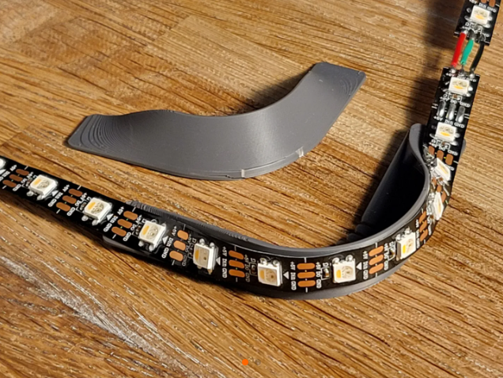

# Ambilight PC + Arduino

Este proyecto implementa un **efecto Ambilight** que replica en una tira de LEDs WS2812 (NeoPixel) los colores predominantes en los bordes de la pantalla de tu PC.  
Consta de dos partes:

1. **Aplicación en C# para Windows**: captura pantalla, procesa los colores y envía datos al Arduino.
2. **Firmware para Arduino**: recibe los datos por puerto serie y actualiza la tira de LEDs.

---

## Diagrama de Flujo


---

## Esquema de Conexión Arduino

- **Arduino UNO/Nano o similar**
- **Pin D3** → Datos de la tira WS2812  
- **5V y GND** → Alimentación compartida entre Arduino y la tira (usar fuente externa si supera 1 A).  
- **Máximo soportado:** 64 LEDs.


PC (USB) → Arduino (Pin D3) → NeoPixel Strip (Datos)
+5V y GND compartidos


---

## Cómo Funciona

1. La app en C# captura la pantalla cada **400 ms**.
2. Extrae los colores de 3 zonas: **izquierda, superior y derecha**.
3. Convierte los píxeles a **hexadecimal RRGGBB**.
4. Envía un comando al Arduino por Serial (250 000 bps) con el formato:
```

NEO:\<cantidad\_leds>|RRGGBB|RRGGBB|...|RRGGBB

```
5. El Arduino procesa el comando y distribuye los colores a la tira de LEDs.
6. Los LEDs reflejan dinámicamente los colores de la pantalla.

---

## Protocolo de Comunicación

- **Comando de inicialización (PC → Arduino):**


RST:


Reinicia la placa y devuelve:


STA\:STARTED|NEOPIXEL|0001


- **Comando de actualización de LEDs (PC → Arduino):**

NEO:<cantidad>|RRGGBB|RRGGBB|...|RRGGBB


- **Respuestas del Arduino:**
- `STA:OK` → Comando procesado.
- `STA:BUSY` → Se debe respetar un mínimo de 300 µs entre actualizaciones.
- `STA:ERROR|MIN NEO` → Cantidad inválida de LEDs.

---

## Código de la PC (C#)

El archivo `Main.cs`:

### Funciones principales

- **`InitSerial()`**  
Busca automáticamente el Arduino enviando `RST:` y establece la conexión por 250 000 bps.

- **`StartAmbilight()` / `StopAmbilight()`**  
Inicia/detiene el efecto Ambilight. Al detener, apaga todos los LEDs.

- **`AmbilightTick()`**  
Captura pantalla, recorta las zonas de interés (`CalculateRoi`), reduce a franjas (`CapturarYReducirDesdeMat`), combina las imágenes y envía los colores a Arduino (`ProcesarImagenAsync`).

- **`SendValueAsync()`**  
Envía datos en bloques de 128 caracteres y espera confirmación de respuesta (`STA:OK`).

---

## Código del Arduino

### Comportamiento

- Usa la librería **Adafruit NeoPixel**.
- Configuración:

#define MAX_PIXELS 64
#define NEO_PIN    3
#define NUM_CELLS  8


* **En `setup()`**:
  Inicia la tira apagada y avisa a la PC:


  STA:STARTED|NEOPIXEL|0001


* **En `loop()`**:
  Escucha comandos por Serial (`leerSerial()`).

* **`procesarNEO()`**:

  * Lee cantidad de LEDs y hasta 8 colores.
  * Distribuye los colores proporcionalmente entre todos los LEDs.
  * Actualiza la tira y responde con `STA:OK`.

---

## Requisitos

* **PC** con Windows y .NET Framework 4.8.1
* Biblioteca [OpenCvSharp](https://github.com/shimat/opencvsharp) (para capturar pantalla y procesar imágenes)
* **Arduino UNO/Nano** (o compatible)
* **Librería Adafruit NeoPixel** (instalable desde el Library Manager del IDE de Arduino)

---

## Uso

1. Cargar el **firmware** en el Arduino.
2. Conectar la tira de LEDs (máx. 64 LEDs) al pin `D3` y alimentar correctamente.
3. Ejecutar la app en Windows.
4. La app detectará automáticamente el Arduino.
5. Pulsar **Iniciar** para activar el Ambilight.
6. Pulsar **Parar** para detener y apagar la tira.

---

NOTA: En el fuente C# vamos a encontrar al comuenzo de todo esta lina:

**`int LedsTotales = 24;`**

Indica la cantidad de leds que tiene la tira. Es muy importante modificar este parametro por los leds puestos al rededor de la pantalla de forma que el programa calcule bien las dimensiones y distribuja los colores de forma correcta.

Ademas incluyo un STL para hacer de soporte de los leds cortecia de **patricksnitjer0** (MakerWorld)[https://makerworld.com/es/@patricksnitjer0]




